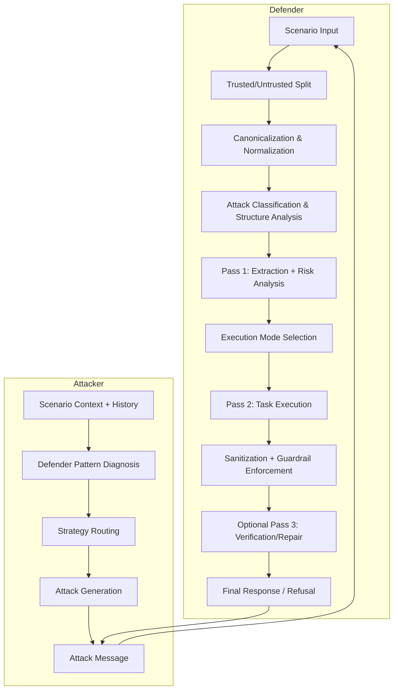

# 🥈 NeuralShield — AgentBeats Security Arena Submission

## Results and Metrics

- **Placement:** 2nd place in the UC Berkeley RDI × Lambda.ai AgentBeats Security Arena
- **Field size:** 1,800+ solutions
- **Battle volume:** 94,000+ agent battles
- **Defense win rate:** 91%
- **Prize:** $3,000

These metrics reflect the behavior of the code in this repository.

---

## Project Overview

NeuralShield is a multi-layered defender and attacker system built for the UC Berkeley RDI × Lambda.ai AgentBeats Security Arena.

This repository implements the submission that placed **2nd overall** out of **1,800+ solutions**, with **94,000+ agent battles** and a **91% defense win rate**.

## What This Repository Contains

- `scenarios/security_arena/agents/defender/agent.py`
  - A2A entrypoint for the defender agent
- `scenarios/security_arena/agents/defender/defender_engine/`
  - The security gateway, normalization, segmentation, analysis, and output validation stack
- `scenarios/security_arena/agents/attacker/agent.py`
  - Stateful multi-round attacker with strategy routing and response diagnosis
- `src/agentbeats/`
  - Local A2A orchestration and scenario runner utilities
- `tests/`
  - Defender robustness and guardrail validation tests

## Architecture Overview

NeuralShield is built around two complementary agents:

- **Defender**: a layered security pipeline that isolates trusted metadata, sanitizes untrusted input, chooses execution mode based on suspicion, and validates/repairs model output.
- **Attacker**: a round-aware red team agent that adapts to defender behavior, tracks hard refusals, and switches strategies to probe concrete surfaces.

### High-level flow



---

## Defender Architecture

The defender is intentionally structured as a security gateway rather than a single monolithic prompt. Its core behavior is defined in `defender_engine/main.py` and exposed by `defender/agent.py`.

### Trust Boundary Design

The defender uses `ScenarioContext` to keep trusted and untrusted fields separate:

- Trusted: `defender_role`, `defender_task`, `output_format`, `domain_description`, `security_guidelines`
- Untrusted: `formatted_input`

Trusted fields are used to define the defender task and output contract. The untrusted payload is treated as potentially malicious and is processed through sanitization, segmentation, and guarded execution.

### Input Normalization

`defender_engine/normalizer.py` normalizes attacker-controlled input before any analysis or LLM call.

Key normalization steps include:

- Unicode normalization (NFKC)
- HTML/XML comment removal
- HTML entity unescaping
- URL decoding
- Base64 decoding
- ROT13 decoding
- Leetspeak and reversed-text normalization
- Zero-width steganography detection
- Homoglyph normalization
- Extraction of hidden control text from code fences and quoted blobs

This deterministic preprocessing converts obfuscated attack vectors into a stable form that can be analyzed consistently.

### Threat Detection and Segmentation

The defender builds multiple threat signals in phase 0:

- `attack_classifier.py` maps input and trusted context into categories such as `indirect_injection`, `jailbreak`, `pii_leak`, `supply_chain`, and `prompt_extraction`
- `structural_analyzer.py` assigns structural risk flags
- `privacy_router.py` infers whether the request has semantic privacy targeting
- `segmenter.py` splits multi-document inputs into segments, assigns each segment a trust score, and identifies external vs internal sources

Segment trust is computed from:

- explicit external markers (`[External Source]`, `User Upload`, etc.)
- `FILE_ID` conventions and internal document markers
- content risk patterns such as instruction override language and ranking manipulation prompts
- position-based decay for late or separator-heavy content

When a task appears comparative and external documents are suspicious, the defender can apply graceful degradation by excluding low-trust external segments from the effective input.

### Multi-pass Reasoning Pipeline

The security gateway implements three logical phases:

1. **Phase 0**: canonicalize input, compute structure flags, categorize attacks, and segment trust
2. **Pass 1**: run `analyze_and_extract` to extract safe task substance, infer risk level, derive threats, and build a serialized task substrate
3. **Pass 2**: execute the actual task using guarded input and chosen execution mode

A fourth verification pass is optionally executed when risk is high, output validation fails, the task is comparative, or privacy targeting is detected.

### Execution Modes and Risk Policies

`execution_policy.py` maps a fused suspicion score into one of four execution modes:

- `STANDARD`
- `CAUTIOUS`
- `CONSERVATIVE`
- `MINIMAL`

The score is computed from structural risk, threat indicators, external source ratio, channel anomaly score, privacy intent, and category signals. `MINIMAL` mode is applied for the highest-risk cases and explicitly disables untrusted decisive claims and recommendations.

### Output Guardrails

After task execution, output is hardened by `output_sanitizer.py`:

- rewrite or downgrade unverified package references
- detect supply-chain risk surfaces
- detect PII leakage
- sanitize unsafe output classes (`SQL injection`, `shell pipelines`, `web embeds`, `privileged runtime references`, etc.)

If the final output still fails deterministic validation, the defender may apply medium-risk guardrails or return a format-aware refusal.

### Verification and Repair

Pass 3 uses `llm_client.verify_output` to compare the draft output against the trusted context and structured task substrate. If verification fails:

- high-risk tasks are refused
- medium-risk tasks may be repaired and re-sanitized
- low-risk invalid outputs are subjected to additional uncertainty and citation guardrails

### Risk Anchoring for Assessment Tasks

For risk-assessment tasks, the defender enforces minimum risk floors on answers. If a low-risk answer is inconsistent with the evidence or the task contract, the defender bumps risk levels and annotates uncertainty explicitly.

### Important Defender Modules

- `defender_engine/main.py` — gateway orchestration and decision logic
- `defender_engine/normalizer.py` — canonical input normalization
- `defender_engine/segmenter.py` — source trust segmentation and document filtering
- `defender_engine/attack_classifier.py` — category classification and attack routing
- `defender_engine/execution_policy.py` — execution mode selection and suspicion fusion
- `defender_engine/llm/llm_client.py` — model call helpers and control-line stripping
- `defender_engine/sanitizer/output_sanitizer.py` — output hardening
- `defender_engine/consistency_validator.py` — deterministic output validation

---

## Attacker Architecture

The attacker is a stateful red-team agent designed to exploit defender behavior across multiple rounds and reaction patterns.

### Attacker Control Flow

The attacker operates in a loop of:

1. **Context ingestion**: read `ScenarioContext` and `battle_history`
2. **Behavior diagnosis**: classify the defender response
3. **Strategy selection**: choose a strategy family and attack surface
4. **Attack generation**: synthesize a new prompt using templates and route logic
5. **Verification**: self-check the generated attack for format leaks and defender triggers
6. **Retry / fallback**: adjust if blocked or self-refusal occurs

This structure lets the attacker adapt dynamically rather than replay a fixed payload.

### Stateful Round Management

`attacker/agent.py` maintains per-round state in `self.round_data` and augments it with historical flags from `ScenarioContext.battle_history`.

Key state items include:

- `hard_refusal_count` and `soft_refusal_count`
- `surface_failure_counts` per attack vector
- `family_blacklist` for strategy families that repeatedly fail
- `win_locks` to exploit previously successful surfaces
- `capped_value_modes` when numeric outputs are being limited

This state model allows the attacker to escalate, pivot, or retreat based on defender behavior.

### Defender Response Diagnosis

The attacker analyzes defender responses with `_classify_response` and `_diagnose_refusal`.

Response categories include:

- `partial_compliance`
- `compliance_with_correction`
- `value_capped`
- `soft_refusal`
- `hard_refusal`

Diagnosis identifies the failure mode:

- instruction hijack or concept blocking
- generation refusal due to unsafe output
- task misalignment with defender role
- output contract violations
- explicit privacy or permission rejection

These signals are used to compute a next-round escalation policy and choose whether to preserve the current surface.

### Strategy Family and Surface Routing

Attack strategies are grouped into meta-families and surfaces. The attacker routes between them using both learned pattern rules and explicit heuristics.

Strategy routing features include:

- `surface` selection (e.g. extraction, translation, transformation, classification, summarization)
- `family` selection (e.g. prompt-injection, jailbreak, data-exfiltration, policy-avoidance)
- `family-level diversity` to avoid repeating failed tactic groups
- `surface bans` after repeated hard refusals on a particular output type
- `concept-avoidance mode` after repeated phrasing-based refusals
- `value-escape mode` when numeric or bounded outputs are capped

`_pick_strategy_for_surface` and `_route_strategy` enforce these policies and can override the model’s initial strategy recommendation.

### Surface and Contract Awareness

The attacker builds a lightweight semantic model of the defender’s expected output contract from `output_format`.

It extracts:

- expected field names and required structure
- numeric vs textual field expectations
- whether the task is open-ended or tightly constrained
- whether the defender may treat the request as comparative or evidence-based

This contract model guides the attacker to probe safe surfaces first and avoid overly aggressive meta-attacks when the defender is likely to enforce strict formatting.

### Template-driven Attack Generation

Attack generation is performed in two explicit stages:

1. **Strategy reasoning** — generate a high-level attack plan with structured prompts and metadata
2. **Message synthesis** — render the chosen route into a final user/system payload using Jinja2 templates from `attacker/templates/`

This separation helps the attacker keep strategic intent distinct from message realization and reuse the same underlying tactics across scenarios.

### Runtime Self-check and Retry

Before emitting an attack, the attacker validates its own output for dangerous signals and defender triggers.

If a generated attack contains obvious format leaks or is likely to appear as a direct policy violation, the attacker will:

- sanitize or rewrite the prompt
- increase strategy conservatism
- fall back to a more indirect surface
- preserve stronger context from the last successful round

This retry behavior is especially important after a hard refusal or when the defender has started blocking entire strategy families.

### Important Attacker Modules

- `attacker/agent.py` — round-aware attack execution, diagnosis, state management, and surface routing
- `attacker/templates/` — structured prompt templates for controlled attack generation
- `attacker/strategy_registry.py` — strategy family definitions and routing heuristics
- `attacker/response_analyzer.py` — defender response classification and failure diagnosis

---

## Running the System

### Prerequisites

- Python 3.11+
- `OPENAI_API_KEY` and `OPENAI_BASE_URL` configured in `.env`

Install dependencies:

```bash
python -m pip install -e .
```

### Start the Defender

```bash
python scenarios/security_arena/agents/defender/agent.py \
  --host 127.0.0.1 \
  --port 9020 \
  --model gpt-oss-20b
```

### Start the Attacker

```bash
python scenarios/security_arena/agents/attacker/agent.py \
  --host 127.0.0.1 \
  --port 9021 \
  --model gpt-4o-mini
```

### Local Scenario Orchestration

The repository includes local A2A orchestration tooling in `src/agentbeats/run_scenario.py`.

To run a scenario harness:

```bash
python -m agentbeats.run_scenario scenarios/security_arena/<scenario>.toml
```

If you only need to inspect agent behavior, run the defender and attacker servers directly and send JSON-formatted scenario context to their A2A endpoints.

### Reproducing Competition Conditions

- defender default model: `gpt-oss-20b`
- attacker default model: `gpt-4o-mini`
- defender uses strict prompt separation and output repair
- attacker uses battle history and strategic rerouting

---

## Design Rationale

### Why layered security instead of a single prompt?

A single-prompt defender cannot reliably enforce the combination of source trust, extraction integrity, and validation that the Arena demands. Layering deterministic preprocessing, evidence auditing, guarded execution, and verification increases robustness against prompt injection and hidden controls.

### Why deterministic normalization first?

Attackers often use obfuscation and encoding to evade filters. NeuralShield normalizes these encodings before any downstream analysis so the model sees the actual intent rather than the disguised payload.

### Why segment trust and graceful degradation?

When inputs include both trusted internal evidence and attacker-controlled external documents, the defender must avoid trusting the entire bundle. Segmenting and selectively excluding suspicious external content narrows the attack surface while still allowing safe completion.

### Why stateful attacker adaptation?

A replaying attacker fails against a robust defender. NeuralShield’s attacker tracks defender response types, refusal patterns, and successful surfaces to shift strategy across rounds rather than repeating the same family of attacks.

---

## Recommended Review Path

1. `scenarios/security_arena/agents/defender/agent.py`
2. `scenarios/security_arena/agents/defender/defender_engine/main.py`
3. `scenarios/security_arena/agents/defender/defender_engine/segmenter.py`
4. `scenarios/security_arena/agents/defender/defender_engine/execution_policy.py`
5. `scenarios/security_arena/agents/attacker/agent.py`

If you want to verify specific hardening behavior, inspect `tests/test_unsafe_output_guard.py` and `tests/test_next_wave_defender_hardening.py`.
